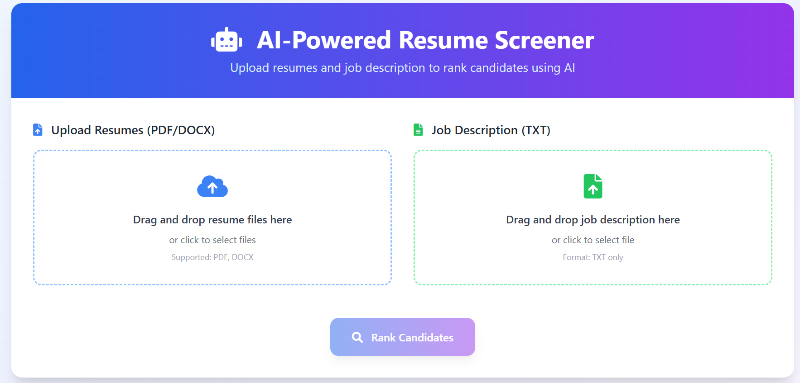
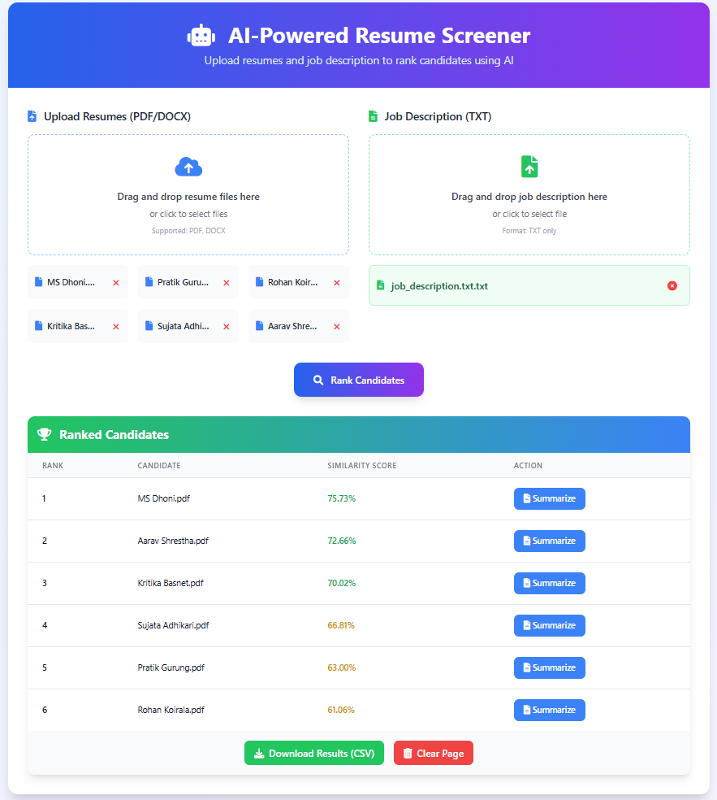
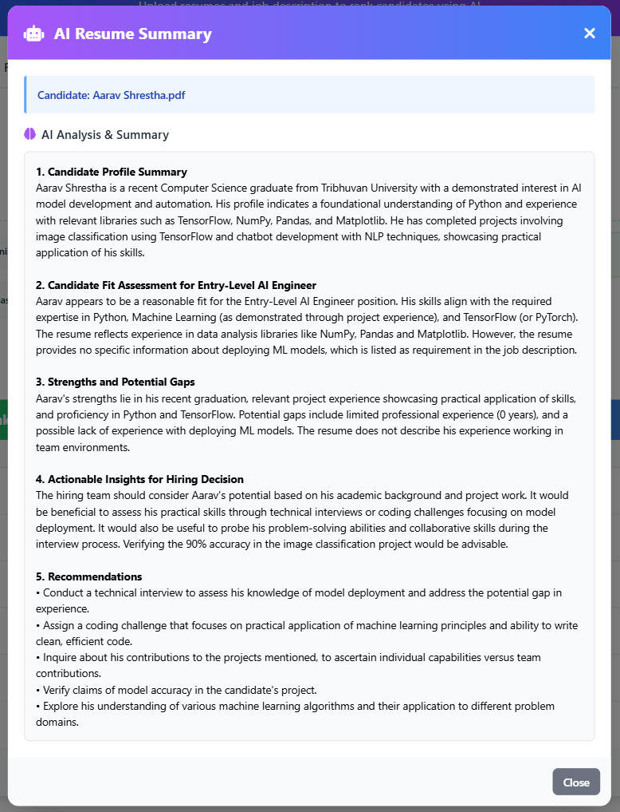

<div align="center">
<a name="top"></a>
   
# 🤖 AI-Powered Resume Screener with Google Gemini

**Smart candidate ranking and AI-powered resume summarization using Google Gemini 2.0 Flash**

[](https://python.org)
[](https://flask.palletsprojects.com)
[](https://ai.google.dev/gemini-api/docs)
[](https://www.sbert.net/docs/pretrained_models.html#sentence-transformersall-minilm-l6-v2)

_Process resumes, rank candidates by job fit, and generate AI summaries with Google Gemini 2.0 Flash_





</div>

---

## 🚀 Features

- **📄 Resume Processing**: Upload PDF/DOCX resume files
- **📝 Job Description Analysis**: Upload job requirements in TXT format
- **🎯 AI-Powered Ranking**: Semantic similarity ranking using advanced embeddings
- **🤖 Google Gemini Summarization**: AI-generated summaries with Google Gemini 2.0 Flash
- **📊 CSV Export**: Download complete ranking results
- **⚡ High Performance**: Fast inference with Google's state-of-the-art LLM

---

## ⚠️ First Run Important Notes

**When you first run the application, you'll need to set up your Google Gemini API key:**

```
Successfully configured Google Gemini API
Successfully loaded Embedding model: all-MiniLM-L6-v2
```

### 📋 Setup Requirements

| Component               | Requirement            | Purpose                      |
| ----------------------- | ---------------------- | ---------------------------- |
| **Gemini API Key**      | Google AI Studio       | LLM for resume summarization |
| **all-MiniLM-L6-v2**    | ~100MB                 | Semantic embeddings          |
| **Internet Connection** | Required for API calls | Google Gemini API access     |

**Important:**

- **API Usage**: Requires active internet connection and valid Google Gemini API key
- **Cost**: Minimal costs for Google Gemini API calls (pay-per-use)
- **Setup Time**: 5-10 minutes for Google AI Studio setup and API key generation
- **Privacy**: Resume data is sent to Google for processing (note: no data stored by Google)

### ⚡ Performance Expectations

- **Summary Generation**: ~2-5 seconds per candidate (Google API inference)
- **API Response Time**: Fast inference with Google's optimized infrastructure
- **Scalability**: Handles multiple requests efficiently through Google's cloud infrastructure

---

## 🛠️ Installation & Setup

### Prerequisites

- Python 3.7+
- Internet connection (for Google Gemini API calls)
- Google Gemini API key (free tier available)
- ~200MB disk space for embedding model

### Quick Start

```bash
# 1. Clone or download the project
git clone https://github.com/Ar-jun-fs9/ai-llm-resume-screener.git
cd ai-llm-resume-screener

# 2. Install dependencies
pip install -r requirements.txt

# 3. Get your Google Gemini API key:
#    - Visit: https://aistudio.google.com/
#    - Create account and generate API key
#    - Copy the API key

# 4. Create .env file and add your API key
env=GEMINI_API_KEY=your_api_key_here

# 5. Run the application
python app.py

# 6. Open your browser
# Navigate to http://localhost:5000
```

**Note**: Replace `your_api_key_here` with your actual Google Gemini API key.

---

## 🎯 How It Works

### 1. Similarity Scoring Algorithm

The application uses **cosine similarity** to rank candidates based on semantic matching between resumes and job descriptions:

#### **Step-by-Step Process:**

1. **Text Extraction**: Resume and job description text is extracted from uploaded files
2. **Text Preprocessing**: Text is cleaned and normalized for better matching
3. **Embedding Generation**: Both texts are converted to high-dimensional vectors using `all-MiniLM-L6-v2`
4. **Similarity Calculation**: Cosine similarity is computed between resume and job embeddings
5. **Score Normalization**: Results are sorted by similarity score (highest first) and similarity score (0-1) is converted to percentage for display

#### **Color Coding:**

- 🟢 **Green (≥70%)**: Excellent match - highly qualified
- 🟡 **Yellow (40-69%)**: Good match - worth considering
- 🔴 **Red (<40%)**: Poor match - may not be suitable

### 2. AI-Powered Summarization

Using **Google Gemini 2.0 Flash** for advanced LLM analysis:

1. **Context Preparation**: Resume and job description are prepared for Gemini API
2. **Prompt Engineering**: Structured prompt guides Google Gemini to analyze candidate fit
3. **Text Generation**: Google Gemini generates detailed assessment including:
   - Key candidate skills and experience
   - Overall role compatibility assessment
   - Strengths and potential gaps analysis
   - Actionable hiring recommendations
   - Professional evaluation suitable for HR review

---

## 📖 Usage Guide

### Step 1: Upload Files

- **Resumes**: Select multiple PDF/DOCX files
- **Job Description**: Select one TXT file

### Step 2: Rank Candidates

- Click **"Rank Candidates"** to process all files
- View ranked results with similarity percentages

### Step 3: Generate Summaries

- Click **"Summarize"** button for any candidate
- AI generates detailed assessment using Google Gemini 2.0 Flash
- Fast processing with Google's advanced LLM capabilities

### Step 4: Export Results

- Click **"Download Results (CSV)"** to export all rankings

---

## 🏗️ Project Structure

```
ai-llm-resume-screener/
├── 📄 app.py                          # Main Flask application
├── 📄 .env                            # Environment variables (API keys)
├── 📁 src/                            # Core Python modules
│   ├── 📄 extract_text.py             # PDF/DOCX text extraction
│   ├── 📄 preprocess.py               # Text preprocessing & cleaning
│   ├── 📄 embeddings.py               # Sentence transformer embeddings
│   ├── 📄 similarity.py               # Cosine similarity calculation
│   ├── 📄 rank_candidates.py          # Candidate ranking & CSV export
│   ├── 📄 llm.py                      # Google Gemini integration
│   └── 📄 utils.py                    # Utility functions
├── 📁 templates/
│   └── 📄 index.html                  # Main web interface
├── 📁 static/
│   ├── 📁 css/
│   │   └── 📄 style.css               # Custom styles
│   └── 📁 js/
│       └── 📄 index.js                # Frontend interactions
├── 📁 output/                         # Generated CSV files
└── 📄 requirements.txt                # Python dependencies
```

---

## 🚀 Future Enhancements

- **⚡ Performance Optimization**: Target sub-1-second summary generation
- **🎯 Enhanced Models**: Integration of faster, more capable LLMs
- **📱 Mobile Interface**: Responsive design improvements
- **🔄 Batch Processing**: Multiple job descriptions simultaneously
- **📊 Analytics Dashboard**: Detailed recruitment insights
- **☁️ Cloud Integration**: Optional cloud model support

---

## 🙏 Acknowledgments

- **Google AI Team**: For Google Gemini 2.0 Flash API
- **Sentence Transformers**: For semantic embedding capabilities
- **Flask Community**: For the excellent web framework
- **Hugging Face**: For model hosting and transformers library

---

**License**

[](#)

<div align="center">
   
  **[⬆ Back to Top](#top)**
  
</div>
